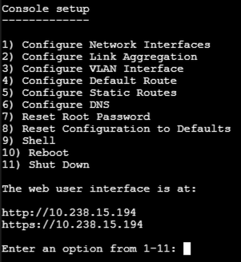

 # 🐧 Własny obraz Live Debian + WebUI – Cz.2: Konsolowe menu z adresem IP i zabezpieczenie WebUI

Ten projekt pokazuje, jak dodać do systemu automatyczne wyświetlanie adresu IP WebUI na konsoli po starcie systemu (w stylu TrueNAS) oraz jak zabezpieczyć folder WebUI przed niepowołanym dostępem.

---
### Inspiracja konsolowym menu od [TrueNAS](https://www.truenas.com/)



Możliwości rozbudowy konsolowego menu:

- Wyświetlanie informacji o sprzęcie: typ procesora, ilość pamięci RAM, model GPU.
- Sprawdzanie dostępności akceleracji GPU (np. CUDA) do zastosowań AI.
- Prezentacja statusu usług systemowych (np. czy WebUI działa, czy serwer SSH jest aktywny).
- Dodanie prostych opcji konfiguracyjnych, np. zmiana portu WebUI, restart wybranych usług.
- Monitoring temperatury CPU/GPU oraz wykorzystania zasobów.
- Integracja z narzędziami diagnostycznymi (np. `lshw`, `nvidia-smi`, `htop`).

Takie rozszerzenia pozwolą stworzyć wygodne centrum zarządzania systemem bezpośrednio z konsoli.

## 📋 Spis treści

1. [Wyświetlanie adresu IP WebUI na konsoli](#1-wyświetlanie-adresu-ip-webui-na-konsoli)
2. [Automatyczne uruchamianie skryptu po zalogowaniu](#2-automatyczne-uruchamianie-skryptu-po-zalogowaniu)
3. [Zabezpieczenie folderu mywebui](#3-zabezpieczenie-folderu-mywebui)
4. [Podsumowanie](#4-podsumowanie)

---

> ⚠️❗**Uwaga!**  
> W tej części przygotowujemy wersję konsolową Debiana (bez GUI). Jeśli mamy własne rozbudowane WebUI, przez które użytkownik komunikuje się z naszym systemem/oprogramowaniem i wykonuje na nim wszystkie istotne operacje, to środowisko graficzne linux nie jest potrzebne.
>  
> Przed rozpoczęciem usuń z pliku (wykorzystując nano) [`moj-debian/config/package-lists/base.list.chroot`](moj-debian/config/package-lists/base.list.chroot) następujące linie:
>
> ```
> xfce4
> openbox
> network-manager
> ```
>
> W pliku powinny pozostać tylko:
>
> ```
> sudo
> ufw
> curl
> wget
> git
> ifupdown
> wpasupplicant
> firmware-iwlwifi
> isc-dhcp-client
> ```

## 1. Wyświetlanie adresu IP WebUI na konsoli

Na początku czyścimy nasz projekt z poprzedniego build i ponownie konfigurujemy:

```bash
lb clean
sudo lb config -d bookworm --debian-installer cdrom --archive-areas "main contrib non-free non-free-firmware" --debootstrap-options "--variant=minbase"
```

Aby użytkownik po zalogowaniu widział adres IP WebUI, wykonaj poniższe kroki:

1. Utwórz folder na skrypt (jeśli nie istnieje):

    ```bash
    mkdir -p config/includes.chroot/usr/local/bin
    ```

2. Utwórz plik skryptu za pomocą edytora nano:

    ```bash
    nano config/includes.chroot/usr/local/bin/show-webui-ip.py
    ```

3. Wklej poniższy kod do pliku:

```python
#!/usr/bin/env python3
import socket
import time

def get_ip():
    for _ in range(10):
        s = socket.socket(socket.AF_INET, socket.SOCK_DGRAM)
        try:
            s.connect(('8.8.8.8', 80))
            ip = s.getsockname()[0]
            if not ip.startswith("127."):
                return ip
        except Exception:
            pass
        finally:
            s.close()
        time.sleep(1)
    return '127.0.0.1'

print("\n" + "#"*60)
print("The WebUI available at:")
print(f"http://{get_ip()}:8080")
print("#"*60 + "\n")
```

4. Nadaj uprawnienia do wykonania:

    ```bash
    chmod +x config/includes.chroot/usr/local/bin/show-webui-ip.py
    ```

---

## 2. Automatyczne uruchamianie skryptu po zalogowaniu

Aby komunikat pojawiał się każdemu użytkownikowi po zalogowaniu na konsoli:

1. Utwórz katalog `skel` (jeśli nie istnieje):

    ```sh
    mkdir -p moj-debian/config/includes.chroot/etc/skel
    ```

2. Utwórz lub edytuj plik `.profile` za pomocą edytora nano:

    ```bash
    nano config/includes.chroot/etc/skel/.profile
    ```

    Na końcu pliku dodaj linię:

    ```
    /usr/local/bin/show-webui-ip.py
    ```


Efekt: Po zalogowaniu na konsoli pojawi się komunikat z adresem IP WebUI.

---

## 3. Zabezpieczenie folderu mywebui

Aby ograniczyć dostęp do folderu `/opt/mywebui` tylko dla wybranych użytkowników:

1. W pliku hooka [`moj-debian/config/hooks/normal/install-webui.chroot`](moj-debian/config/hooks/normal/install-webui.chroot) dodaj na końcu:

    ```sh
    chmod 700 /opt/mywebui
    chown root:root /opt/mywebui
    ```

...
   Dzięki temu tylko root będzie miał dostęp do folderu z WebUI.

>ℹ️ **Uwaga:**  
> To zabezpieczenie chroni folder przed dostępem zwykłych użytkowników systemu.  
> Każdy użytkownik posiadający uprawnienia administratora (root) będzie miał pełny dostęp do wszystkich plików w systemie, w tym do `/opt/mywebui`.  
> Jest to standardowe zachowanie w systemach Linux.
>
> W większości przypadków takie proste zabezpieczenie jest wystarczające – np. gdy to my instalujemy system u klienta (np. automotive) i odpowiadamy za jego konserwację, a klient nie ma dostępu do konta root.  
> Jeśli jednak klient samodzielnie instaluje system i chcemy uniemożliwić dostęp do wszystkich plików wykonawczych naszego rozwiązania, konieczne będzie zastosowanie bardziej zaawansowanych metod zabezpieczenia instalacji ISO.

---

Na zakończenie budujemy nasz obraz ISO:

```bash
sudo lb build
```

---

## 4. Podsumowanie

- Po starcie systemu i zalogowaniu na konsoli użytkownik zobaczy adres IP WebUI.
- Folder z WebUI jest zabezpieczony przed niepowołanym dostępem.
- Wszystkie zmiany są automatycznie uwzględniane podczas budowania obrazu ISO.

---

**Struktura plików tej części tutoriala:**

```
moj-debian/
├── config/
│   ├── includes.chroot/
│   │   ├── etc/
│   │   │   └── skel/
│   │   │       └── .profile
│   │   └── usr/
│   │       └── local/
│   │           └── bin/
│   │               └── show-webui-ip.py
│   └── hooks/
│       └── normal/
│           └── install-webui.chroot
```

---

## 🔗 Przydatne linki

- [TrueNAS – inspiracja menu konsolowym](https://www.truenas.com/)

---

## Autor i licencja

- Autor: [Sebastian Bartel](https://github.com/SebastianSebastianB)
- E-mail: umbraos@icloud.com
- Licencja: MIT

---