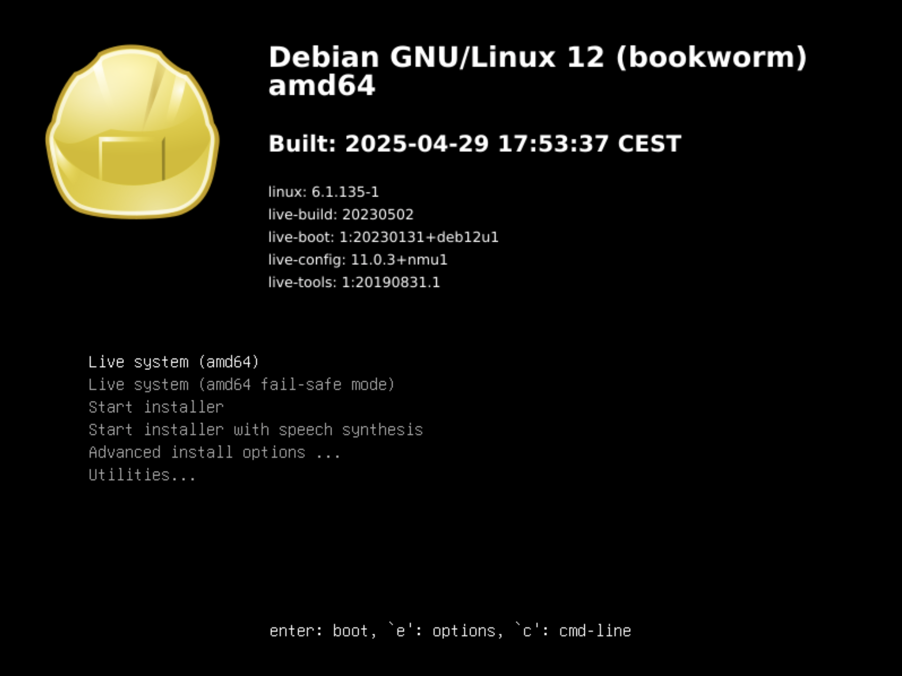
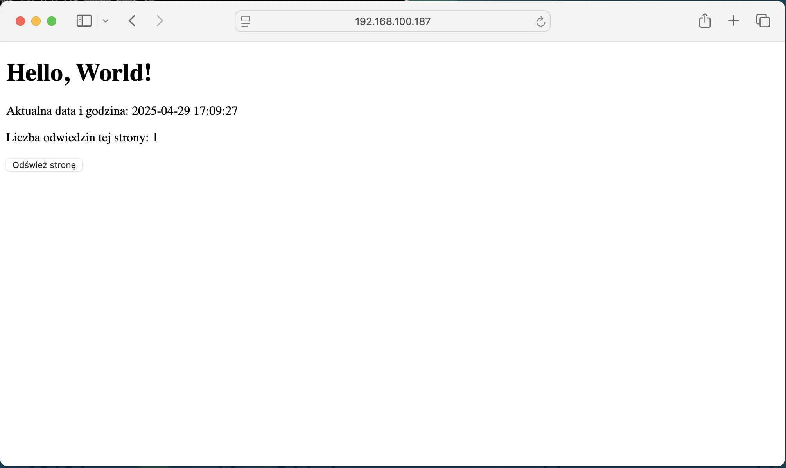
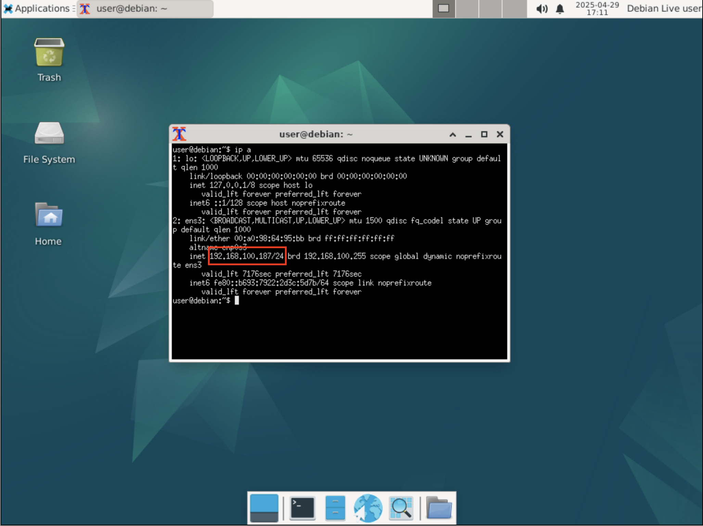

# 🐧 Własny obraz Live Debian + instalacja z WebUI - Cz.1

Ten projekt pokazuje, jak krok po kroku zbudować własny obraz ISO Debiana z lekkim środowiskiem graficznym XFCE oraz własnym WebUI napisanym w Pythonie (Flask).  
Dzięki temu możesz stworzyć własną, spersonalizowaną dystrybucję Debiana!

---

## 📸 Zrzuty ekranu

### Instalacja systemu



### Działające WebUI



---

## 📋 Spis treści

1. [Wymagania](#wymagania)
2. [Instalacja narzędzi](#instalacja-narzędzi)
3. [Konfiguracja projektu](#konfiguracja-projektu)
4. [Dodanie pakietów](#dodanie-pakietów)
5. [Tworzenie WebUI](#tworzenie-webui)
6. [Konfiguracja systemd](#konfiguracja-systemd)
7. [Budowanie obrazu ISO](#budowanie-obrazu-iso)
8. [Najczęstsze problemy](#najczęstsze-problemy)
9. [Autor i licencja](#autor-i-licencja)

---

## 🛠️ Wymagania

- System: Debian 12 (Bookworm)
- Uprawnienia sudo
- Połączenie z internetem
- około 7GB wolnego miejsca na dysku

---
## Instalacja narzędzi

```bash
sudo apt update
sudo apt install nano debootstrap git live-build
```

---

## Konfiguracja projektu

```bash
sudo mkdir moj-debian
cd moj-debian
```
:bulb: Wczytkie następne komendy wykonywane będą z poziomu folderu projektu.

---

## Konfiguracja live-build

```bash
lb clean
sudo lb config -d bookworm --debian-installer cdrom --archive-areas "main contrib non-free non-free-firmware" --debootstrap-options "--variant=minbase"
```
:bulb: Szczegółowy opis parametrów konfiguracyjnych jest w dokumentacji: 
[dokumentacja configuracji](https://manpages.debian.org/unstable/live-build/lb_config.1.en.html)

---

## Dodanie pakietów

### 4a. Pakiety systemowe

Stwórz plik z listą podstawowych pakietów systemowych:

```bash
nano config/package-lists/base.list.chroot
```

Wklej do pliku:

```
# Podstawowe narzędzia i pakiety systemowe (konsola)
sudo
ufw
curl
wget
git
ifupdown
wpasupplicant
firmware-iwlwifi
isc-dhcp-client

# Podstawowe środowisko graficzne i narzędzia
xfce4
openbox
network-manager
```

Opis poszczególnych pakietów (UWAGA: tego nie zamieszczamy w base.list.chroot)
```
# Podstawowe narzędzia i pakiety systemowe (konsola)
# sudo                # Zarządzanie uprawnieniami administratora
# ufw                 # Prosty firewall (Uncomplicated Firewall)
# curl                # Pobieranie plików i danych z internetu (HTTP, FTP)
# wget                # Pobieranie plików z internetu (HTTP, FTP)
# git                 # System kontroli wersji
# ifupdown            # Zarządzanie interfejsami sieciowymi
# wpasupplicant       # Obsługa sieci Wi-Fi (WPA/WPA2)
# firmware-iwlwifi    # Sterowniki do kart Wi-Fi Intel
# isc-dhcp-client     # Klient DHCP do automatycznej konfiguracji sieci

# Podstawowe środowisko graficzne i narzędzia
# xfce4               # Lekkie środowisko graficzne XFCE
# openbox             # Lekki menedżer okien (opcjonalnie, alternatywa dla XFCE)
# network-manager     # Graficzne i konsolowe narzędzie do zarządzania siecią
```

### 4b. Pakiety Python (np. Flask, OpenCV, PyTorch itp.)

```bash
nano config/package-lists/python.list.chroot
```

Wklej:

```
python3
python3-pip
python3-venv
# python3-flask  # Flask zainstalujemy przez pip
```

💡 **Wskazówka:** 
Jest to najprostsza metoda instalacji bibliotek Python, ale tutaj trzeba uważać ponieważ repozytorium Debiana może nie mieć aktualnych i/lub konkretnych wersji pakietów python.

Jeśli potrzebujesz konkretnej lub najnowszej wersji, najlepiej:

	•	Dodać python3-pip do listy pakietów,
	•	Przygotować requirements.txt z odpowiednimi wersjami,
	•	Użyć hooka z pip install -r requirements.txt.

To daje Ci pełną kontrolę nad wersjami bibliotek Python i pewność, że środowisko będzie zgodne z Twoimi wymaganiami.

---

## Tworzenie WebUI

### 5.1. Utwórz folder na aplikację

```bash
mkdir -p config/includes.chroot/opt/mywebui
```

### 5.2. Stwórz plik aplikacji
💡 **Wskazówka:** Ten krok można pominąć jeśli masz już przygotowane własne WebUI i wystarczy tylko przekopiować własne WebUI do folderu mywebui.

```bash
nano config/includes.chroot/opt/mywebui/app.py
```

Wklej:

```python
from flask import Flask, render_template_string, request
from datetime import datetime

app = Flask(__name__)
visit_count = 0

TEMPLATE = """
<!DOCTYPE html>
<html>
<head>
    <title>My WebPage</title>
</head>
<body>
    <h1>Hello, World!</h1>
    <p>Aktualna data i godzina: {{ now }}</p>
    <p>Liczba odwiedzin tej strony: {{ count }}</p>
    <form method="get">
        <button type="submit">Odśwież stronę</button>
    </form>
</body>
</html>
"""

@app.route("/", methods=["GET"])
def hello():
    global visit_count
    visit_count += 1
    return render_template_string(
        TEMPLATE,
        now=datetime.now().strftime("%Y-%m-%d %H:%M:%S"),
        count=visit_count
    )

if __name__ == "__main__":
    app.run(host="0.0.0.0", port=8080)
```

### 5.3. Plik z zależnościami (requirements.txt)

```bash
nano config/includes.chroot/opt/mywebui/requirements.txt
```

Wklej:

```
flask
```

### 5.4. Hook instalujący zależności w virtualenv
Aby Flask był zainstalowany automatycznie, możesz dodać hook instalujący zależności
(hook utworzy środowisko virtualenv i tam instaluje zależności)

```bash
mkdir -p config/hooks/normal/
nano config/hooks/normal/install-webui.chroot
```

Wklej:

```bash
#!/bin/sh
python3 -m venv /opt/mywebui/venv
/opt/mywebui/venv/bin/pip install -r /opt/mywebui/requirements.txt
```

Nadaj uprawnienia:

```bash
chmod +x config/hooks/normal/install-webui.chroot
```

---

## Konfiguracja systemd
Tworzymy usługę mywebui.service, która będzie uruchamiała nasze WebUI po każdym starcie systemu

### 6.1. Plik usługi

```bash
mkdir -p config/includes.chroot/etc/systemd/system
nano config/includes.chroot/etc/systemd/system/mywebui.service
```

Wklej:

```
[Unit]
Description=My WebUI

[Service]
ExecStart=/opt/mywebui/venv/bin/python /opt/mywebui/app.py
WorkingDirectory=/opt/mywebui
Restart=always
User=root

[Install]
WantedBy=multi-user.target
```

### 6.2. Hook aktywujący usługę

```bash
nano config/hooks/normal/enable-mywebui.chroot
```

Wklej:

```bash
#!/bin/sh
systemctl enable mywebui.service
```

Nadaj uprawnienia:

```bash
chmod +x config/hooks/normal/enable-mywebui.chroot
```

---

## 📁 Struktura katalogów i plików projektu

Poniżej znajduje się przykładowa struktura katalogów i plików, które zostaną utworzone podczas realizacji tego tutoriala:

```
moj-debian/
├── config/
│   ├── includes.chroot/
│   │   ├── opt/
│   │   │   └── mywebui/
│   │   │       ├── app.py
│   │   │       └── requirements.txt
│   │   └── etc/
│   │       └── systemd/
│   │           └── system/
│   │               └── mywebui.service
│   ├── package-lists/
│   │   ├── base.list.chroot
│   │   └── python.list.chroot
│   └── hooks/
│       └── normal/
│           ├── install-webui.chroot
│           └── enable-mywebui.chroot
├── ... (pozostałe pliki wygenerowane przez live-build)
```


**Opis najważniejszych elementów:**
- `config/package-lists/` – listy pakietów do zainstalowania w systemie.
- `config/includes.chroot/opt/mywebui/` – katalog z aplikacją WebUI (plik `app.py` i `requirements.txt`).
- `config/hooks/normal/` – skrypty (hooki) wykonywane podczas budowania systemu (np. instalacja zależności, aktywacja usługi).
- `config/includes.chroot/etc/systemd/system/` – plik definicji usługi systemd dla WebUI.


## Budowanie obrazu ISO

Aby zbudować własny obraz ISO Debiana z przygotowaną konfiguracją, uruchom poniższe polecenie w katalogu projektu:

```bash
sudo lb build
```

Proces budowania może potrwać od kilku do kilkudziesięciu minut w zależności od wydajności komputera oraz szybkości łącza internetowego (pobierane są wszystkie wymagane pakiety).

Po zakończeniu w katalogu projektu pojawi się plik `.iso` (np. `live-image-amd64.hybrid.iso`).  
Ten plik możesz:

- **Uruchomić w maszynie wirtualnej** (np. VirtualBox, QEMU, VMware)
- **Nagrać na pendrive** (np. za pomocą balenaEtcher, Rufus, dd) i uruchomić na fizycznym komputerze
- **Zainstalować system** na dysku lub używać w trybie Live

💡 **Wskazówka:**  
Przed każdą modyfikacją oraz budowaniem ISO należy uruchomić:
```bash
lb clean
lb config ... nasze parametry ...
```
Jeśli pojawią się błędy podczas budowania, sprawdź komunikaty w terminalu – najczęściej dotyczą one brakujących pakietów lub błędów w konfiguracji.

---

### Jak odczytać adres IP WebUI

W terminalu wpisujemy:
```bash
ip a
```

W przeglądarce wpisujemy:
```bash
http://ADRES_IP:8080
```



### Pliki z preintalowanym WebUI


---

## Najczęstsze problemy

> :warning: **Problem:** Błąd z debootstrap  
> **Rozwiązanie:**  
> Sprawdź, czy `/usr/sbin/debootstrap` istnieje:  
> `ls -l /usr/sbin/debootstrap`  
> Jeśli tak, uruchom build z pełną ścieżką:  
> `PATH=$PATH:/usr/sbin lb build`  
> Lub dodaj sbin do PATH:  
> `export PATH=$PATH:/usr/sbin`

> :warning: **Problem:** Błędy uprawnień do folderów  
> **Rozwiązanie:**  
> W głównym katalogu projektu:  
> `sudo chown -R NAZWA_UZYTKOWNIKA:NAZWA_UZYTKOWNIKA .`

---

## 🔗 Przydatne linki

- [live-build lb_config – dokumentacja configuracji](https://manpages.debian.org/unstable/live-build/lb_config.1.en.html)
- [Oficjalna dokumentacja Debian Live Systems](https://wiki.debian.org/DebianLive)
- [Debian Live Systems – przykłady konfiguracji](https://live-team.pages.debian.net/live-manual/html/live-manual/examples.en.html)

---

## Autor i licencja

Autor: [Sebastian Bartel](https://github.com/SebastianSebastianB)  
Licencja: MIT

---

